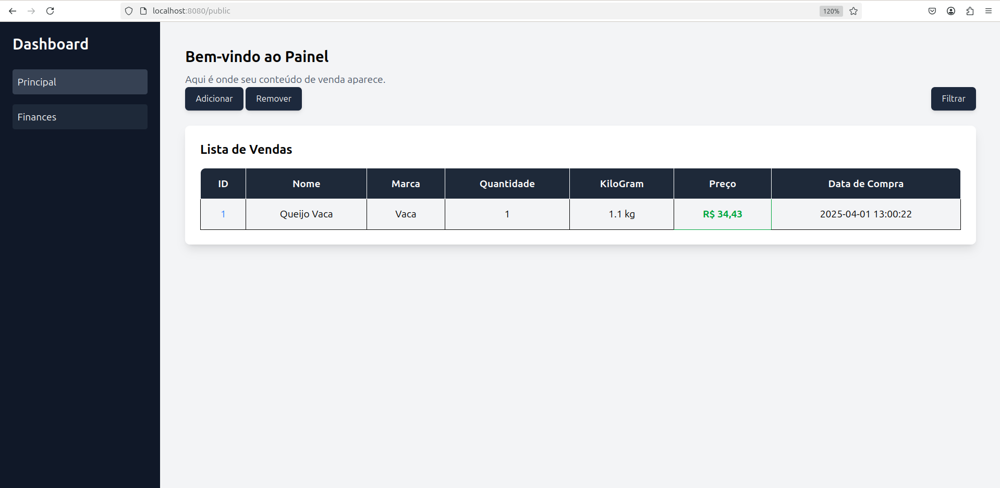

# Gerente vendas mercado 🛒

> lorem impsum



## Tecnologias 🛠️

-   PHP:

## Como instalar projeto ⚙️

### Linux, Windows, MacOs 🐘

configurações seu ambiente e clonagem no git hub

```
git clone https://github.com/danielBRTanimacao/mercado-local-php.git
```

inicie seu ambiente de desenvolvimento clonando o projeto entre no arquivo `mercado-queijo-php` e inicie seu projeto (opcional)

```
git init
git branch -M main
git remote add origin "SUA-URL-GITHUB"
git add .
git commit -a -m "first commit"
git push -u origin main
```

Opcional para clonagem e postagem no seu github

### instalação de dependencias no LINUX 🐧

update suas dependencias e repositorios

```
sudo apt update
sudo apt upgrade
```
